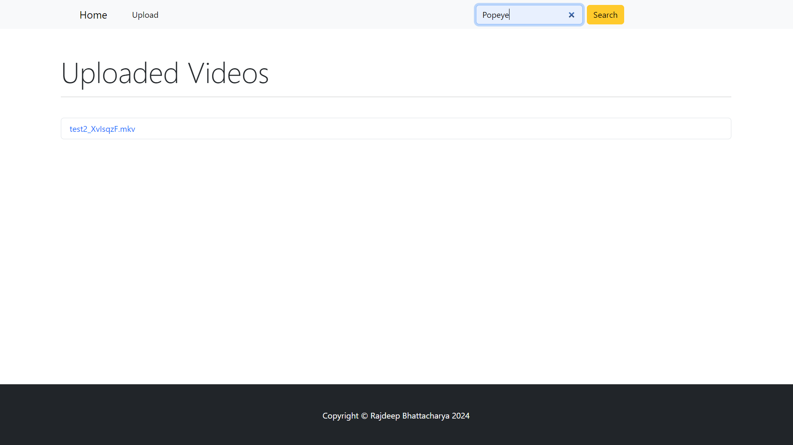
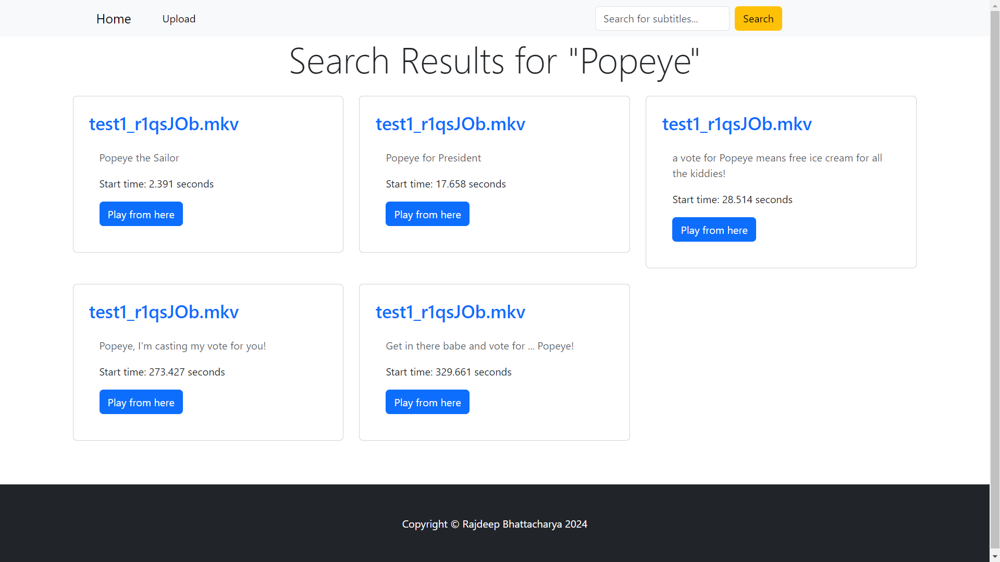

# Video and Subtitle Processing Website

## Project Overview

This project is a video and subtitle processing website that allows users to upload videos, process them in the background, extract subtitles, and return them to the frontend as closed captions. The website supports multiple language subtitles and includes features like video search and a list view for uploaded videos.

## Key Features

1. **Video Upload & Background Processing**  
   - Users can upload videos, which are processed in the background.
   - Subtitles are extracted from the video using `ffmpeg` and returned to the frontend as closed captions.
   - The application supports multi-language subtitle extraction and processing.
   - The extracted subtitles are displayed along with the video in the frontend.

   

   

2. **Search Functionality**  
   - Users can search for phrases in the video's subtitles and retrieve timestamps for when they occur.
   - Clicking a timestamp starts the video from that specific point.
   - Search is case-insensitive, ensuring accurate results regardless of capitalization.

   

   

3. **List View for Uploaded Videos**  
   - The website includes a list view of uploaded videos.
   - Selecting a video shows the video with corresponding subtitles and other subtitle-related features.

   

## Technical Details

- **Subtitle Extraction**  
   - `ffmpeg` is used for extracting subtitles from videos.  
   - It must be installed within the Docker container.

- **Docker**  
   - The application is containerized with Docker, which includes the Django backend, PostgreSQL database, and related services.  
   - The project includes a `docker-compose.yml` file to simplify the development and deployment process.

- **Backend**  
   - Developed using Django, the backend manages video uploads, subtitle extraction, and search functionality.  
   - PostgreSQL is used to store video data and subtitles.

- **Frontend**  
   - A simple yet functional UI is provided, focusing on the core functionality rather than design.

## Project Structure

- **Django**: Handles video upload, subtitle extraction, and the backend logic for search functionality.  
- **PostgreSQL**: Stores video and subtitle information.  
- **ffmpeg**: Responsible for subtitle extraction.  
- **Docker**: Used to containerize the entire project and its dependencies.

## Setup Instructions

1. **Install Docker**  
   - Ensure Docker is installed on your system. You can download it from [here](https://www.docker.com/).

2. **Clone the Repository**  
   ```bash
   git clone https://github.com/localgroup/Video_Subtitle
   cd Video_Subtitle


3. **Build and Start the Containers**:  
   ```
   docker-compose build
   docker-compose up

4. **Access the Application**:
   - Open your browser and navigate to http://localhost:8000 to access the web interface.
